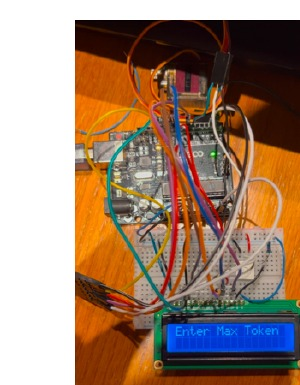
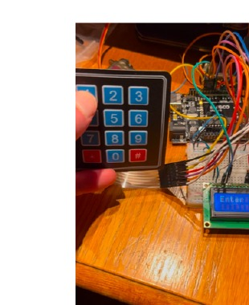
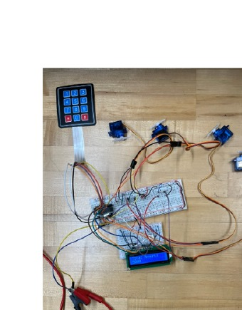
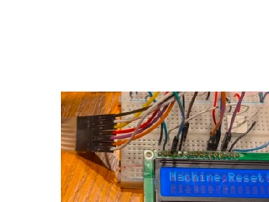

# Automated Poker Chip Dispenser

## Project Overview

The Automated Poker Chip Dispenser was developed as a team project for ECE 388: Embedded System Design at the University of Massachusetts Dartmouth.

The system uses an ATmega328P microcontroller to coordinate user input, display feedback, and servo-driven dispensing. A 3x4 membrane keypad is used for commands, a 16x2 LCD provides system feedback, and four SG90 servo motors control chip dispensing.

## Project Photos

### LCD User Input

### Keypad Interaction

### Servo Testing and Dispensing

### System Reset

## Hardware

- ATmega328P microcontroller
- Four SG90 servo motors
- 3x4 membrane keypad
- 16x2 LCD
- Custom PCB
- Voltage regulation and protection circuitry
- 3D-printed enclosure

## Firmware

The firmware was developed in C/C++ using the Arduino IDE. It handles keypad input, LCD prompts, servo control, chip-value configuration, requested-amount processing, dispensing, and system reset behavior.

[View Arduino Source Code](src/AutomatedPokerChipDispenser.ino)

## PCB & Mechanical Integration

KiCad was used for circuit/PCB design work. The project documentation also describes a SolidWorks-designed PLA enclosure with four chip compartments, servo mounts, and openings for the keypad and LCD.

## Testing & Debugging

Testing covered keypad input, servo actuation, LCD feedback, timing, and hardware-software synchronization. The team report documents successful keypad operation and one-chip-per-command servo dispensing during testing.

## My Contributions

My portfolio highlights my hands-on work with embedded programming, hardware-software integration, soldering, testing, and debugging on this team project.

## Documentation

[View Full Project Report](docs/Automated-Poker-Chip-Dispenser-Report.pdf)

## Demo

A project demo video can be added to the `demo/` folder.
